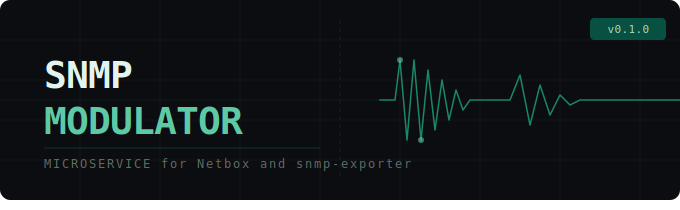

# SNMP MODULATOR

<p align="center">
  
</p>

Probes NetBox devices against [snmp-exporter](https://github.com/prometheus/snmp_exporter) modules
and writes back the `snmp_exporter_module` custom field with only the modules that return useful data.
Optionally discovers and validates SNMP auth profiles.

## How it works

1. Fetch devices from NetBox (by host or filter)
2. Evaluate which modules to `add` (unconditional), `try` (probe), or `block` (veto) — from `mapping.yaml`
3. Probe each `try` module: `GET /snmp?target=<ip>&module=<module>&auth=<profile>`
4. Keep modules that return at least one non-housekeeping metric (`up=1` alone doesn't count)
5. Write the final module list back to `snmp_exporter_module` in NetBox

Auth discovery (optional): before module probing, validate or discover the SNMP auth profile by
probing a canary module and checking `up=1`. Written back to `snmp_auth_profile` if changed.

---

## NetBox custom fields

| Field | Type | Required | Direction |
|---|---|---|---|
| `snmp_exporter_module` | multi-select (choice set) | yes | read + **write** — final module list |
| `snmp_auth_profile` | text | yes | read + **write** (when auth probing resolves a different profile) |
| `snmp_polling_interval` | selection | no | read + **write** — Prometheus scrape interval; choice set provides the step ladder |
| `snmp_polling_timeout` | selection | no | read + **write** — Prometheus scrape timeout; choice set provides the step ladder |

The two mandatory fields must exist on all devices the modulator processes. Field names are configurable in `mapping.yaml` (`modules.field`, `auth.field`) and can be overridden per-run via CLI.

Optional fields are only written when enabled in `mapping.yaml`:
- `snmp_polling_*` — only when `modules.interval_field` / `modules.timeout_field` are set; omit both to measure and log durations without writing

---

## mapping.yaml

All probe behaviour is controlled by `mapping.yaml`.

### Global Settings

```yaml
modules:
  field:  snmp_exporter_module  # NetBox multi-select custom field
  policy: drop                  # use | try | drop

auth:
  field:        snmp_auth_profile        # NetBox text custom field
  policy:       use                      # use | try | drop
  probe_module: system                   # canary module for auth probing; override per-rule
```

`modules.policy` — how to treat modules already in the field at run start:

| Value | Meaning |
|---|---|
| `use` | Keep existing modules unconditionally (non-destructive / append mode) |
| `try` | Re-probe existing modules; keep if still useful |
| `drop` | Ignore existing modules (default) |

`auth.policy` — how to handle the SNMP auth profile:

| Value | Meaning |
|---|---|
| `use` | Trust NetBox value as-is; no probing. May be overridden per-rule with `auth.try`. |
| `try` | Probe rule candidates in declared order; NetBox value appended as last-resort fallback |
| `drop` | Ignore NetBox value; discover working profile from rule candidates only |

Rule-level `auth.try` is always probed in the order written — the rule author's preference (e.g. v3 before v2) is honored. With global `policy=try`, the device's current NetBox profile is appended to the end of the candidate list as a final fallback (deduped if already present).

### defaults

Applied to every device before rules are evaluated:

```yaml
defaults:
  modules:
    add:   []
    try:   [system, if_full]   # probed — only written if they return useful data
    block: []
  auth:
    try: []    # fallback auth candidates when global auth.policy: try/drop and no rule matches
```

### Per-rule operations

Each rule has `modules` and `auth`, mirroring the top-level structure:

```yaml
- name: "Example rule"
  match:
    device_type.manufacturer.slug: "cisco"
    role.slug: "switch"
  modules:
    add:
      - if_full          # always in final set, no probe
    try:
      - cisco_generic    # probe — include only if useful data returned
      - _ALL             # expand to every module known to snmp-exporter (/config)
    block:
      - if_mib           # veto — wins over add/try from any rule
      - _ALL             # nuclear veto — final list is empty regardless of other rules
  auth:
    use: SNMPV3_CISCO    # unconditional — no probe, write back if different
    use: ~               # clear the auth profile field
    try:
      - SNMPV3_L3        # probe in order; first returning up=1 wins
      - _ALL             # expand to every auth profile known to snmp-exporter (/config)
    probe_module: if_mib # canary module override for this rule's auth probing
```

Any NetBox field reachable by dot-notation is a valid `match` key:
`role.slug`, `device_type.manufacturer.slug`, `device_type.model`, `platform.slug`,
`site.slug`, `status.value`, `custom_fields.<name>`, `name`, `tags`, etc.

List fields (`tags`) match if **any** element matches. Tags are matched by slug.

Absent match keys are wildcards. All patterns are `re.fullmatch` (case-insensitive).


<details>
<summary><strong>Full mapping.yaml example</strong></summary>

```yaml
modules:
  field:            snmp_exporter_module
  policy:           drop
  interval_field:   snmp_polling_interval
  timeout_field:    snmp_polling_timeout
  default_interval: 3m
  default_timeout:  2m

auth:
  field:        snmp_auth_profile
  policy:       use
  probe_module: system

defaults:
  modules:
    add:   []
    try:   [system, if_full]
    block: []
  auth:
    try:
      - _ALL

rules:

  # ── Cisco new-access (C9200/C9300) ──────────────────────────────
  - name: "Cisco new-access (C9200/C9300)"
    match:
      device_type.manufacturer.slug: "cisco"
      device_type.slug: "C9[23]0[05].*"
    modules:
      add:
        - if_full
      block:
        - if_full_legacy
        - if_error
        - if_status
      try:
        - cisco_generic
        - cisco_sensor
        - cisco_envmon
        - cisco_process
        - cisco_stackwise
        - cisco_rf

  # ── Cisco NX-OS ─────────────────────────────────────────────────
  - name: "Cisco NX-OS"
    match:
      device_type.manufacturer.slug: "cisco"
      custom_fields.os_name: ".*NX-OS.*"
    modules:
      add:
        - if_full
      block:
        - if_mib
        - cisco_envmon
        - cisco_stackwise
      try:
        - cisco_generic
        - cisco_sensor
        - cisco_process

  # ── Fortinet FortiGate (default) ────────────────────────────────
  - name: "Fortinet FortiGate"
    match:
      device_type.manufacturer.slug: "fortinet"
    auth:
      use: SNMPV3_FORTINET
    modules:
      try:
        - fortinet_fortigate

  # ── Fortinet FortiManager ────────────────────────────────────────
  - name: "Fortinet FortiManager"
    match:
      device_type.manufacturer.slug: "fortinet"
      custom_fields.snmp_auth_profile: ".*FortiManager.*"
    auth:
      use: SNMPV3_FORTINET
    modules:
      block:
        - fortinet_fortigate
      try:
        - fortinet_fortimanager

  # ── LWAPP APs — no SNMP ─────────────────────────────────────────
  - name: "Cisco LWAPP APs"
    match:
      role.slug: "lwapp-ap"
    auth:
      use: ~
    modules:
      block:
        - _ALL

  # ── Vendor-scoped auth discovery ────────────────────────────────
  # Auth is first-match — more specific rules above may have already won.
  # If no vendor rule matches, auth falls through to defaults.auth.try.
  - name: "Cisco — auth discovery"
    match:
      device_type.manufacturer.slug: "cisco"
      custom_fields.snmp_auth_profile: ""
    auth:
      try:
        - SNMPV3_L3
        - SNMPV3_L2

  - name: "Fortinet — auth discovery"
    match:
      device_type.manufacturer.slug: "fortinet"
      custom_fields.snmp_auth_profile: ""
    auth:
      try:
        - SNMPV3_FORTINET

  # ── Last-resort tag-driven discovery ────────────────────────────
  # Tag a device "discover" to run a full blind discovery:
  #   - auth.try: _ALL overrides global auth_policy=use — tries every known profile
  #   - modules: tries every module known to snmp-exporter
  # On success: removes the discover tag.
  # On failure: adds fix-snmp tag for manual follow-up.
  - name: "Last-resort discovery (tag-driven)"
    match:
      tags: "discover"
    auth:
      try:
        - _ALL
    modules:
      try:
        - _ALL
    on_success:
      remove_tag:
        - discover
        - fix-snmp
      notify: http://nexttool/done
    on_fail:
      add_tag: [fix-snmp]
```

</details>


### Handlers

Each rule can define `on_success` and `on_fail` blocks that run after the probe completes.
Handlers from all matching rules are accumulated.

| Key | Meaning |
|---|---|
| `add_tag: [slug, ...]` | Add NetBox tag(s) to the device |
| `remove_tag: [slug, ...]` | Remove NetBox tag(s) from the device |
| `notify: <url>` | HTTP GET to URL (fire-and-forget) |

Tag changes are batched with the module write when modules changed — one API call.
`on_success` fires when the final module set is non-empty and no probe errors occurred.
`on_fail` fires when: any module probe returned an error, the final module set is empty (nothing useful found), or the device was skipped due to auth failure.

```yaml
- name: "Discover SNMP"
  match:
    tags: "discover"
  modules:
    try:
      - _ALL
  on_success:
    remove_tag: [discover]
    notify: http://nexttool/done
  on_fail:
    add_tag: [fix-snmp]
```

### Resolution order

**Auth** (first-match — stops at first matching rule with an `auth:` section):
1. Walk rules in order; for the first matching rule with an `auth:` section:
   - `auth.use` → use that profile directly, no probe (global policy irrelevant)
   - `auth.use: ~` → clear the field, no probe (global policy irrelevant)
   - `auth.try` → build candidate list — fires regardless of global `auth.policy`:
     - `auth.policy: try` → prepend current NetBox value to candidates
     - `_ALL` → expand to every profile from snmp-exporter `/config`
     - probe each in order; first returning `up=1` wins
2. No matching rule → apply global `auth.policy` as fallback:
   - `use` → trust NetBox value as-is, no probing, done. **Empty auth → device skipped (no point probing)**
   - `try` → prepend NetBox value to `defaults.auth.try` candidates, then probe
   - `drop` → use `defaults.auth.try` candidates only, then probe
3. No candidate succeeds → **device skipped entirely, no module probing**
4. Resolved profile differs from NetBox value → write back (respects `dry_run`)

> **Auth is first-match; modules are accumulative.** A device can match many rules — all
> contribute to the module test set (duplicates deduplicated automatically), but only the first
> matching rule with an `auth:` section is used for auth. To write a fallback auth-discovery rule
> that only fires for devices with no profile yet, add `custom_fields.snmp_auth_profile: ""`
> to its `match:` block. If the modules it introduces are already covered by earlier rules,
> the guard is optional — the duplicate probes are simply deduplicated.

**Modules** (accumulative — all matching rules contribute):
1. Seed from `defaults.modules` (`add`, `try`, `block`)
2. Walk all rules; each matching rule accumulates into `add`, `try`, `block`
   - `_ALL` in `block` → return empty immediately, skip remaining steps
   - `_ALL` in `try` → expand to every module from snmp-exporter `/config`
3. `block` veto: remove from `add` and `try`
4. Probe each `try` module; keep those returning useful data
5. Final: `sorted(add ∪ useful_try)`

---

## Environment variables

| Variable | Default | Description |
|---|---|---|
| `NETBOX_URL` | required | NetBox base URL |
| `NETBOX_TOKEN` | required | NetBox API token |
| `NETBOX_TLS_VERIFY` | `true` | Verify NetBox TLS certificate |
| `SNMP_EXPORTER_URL` | required | snmp-exporter base URL |
| `SNMP_EXPORTER_TLS_VERIFY` | `true` | Verify snmp-exporter TLS certificate |
| `SNMP_EXPORTER_TIMEOUT` | `30` | Per-probe timeout in seconds |
| `MAPPING_FILE` | `mapping.yaml` | Path to mapping config |
| `MODULATOR_DRY_RUN` | `false` | Log changes without writing to NetBox |
| `MODULATOR_AUTH_TOKEN` | unset | Bearer token for `/probe` endpoints (disabled if unset) |
| `MODULATOR_PORT` | `8080` | Server listen port |
| `MODULATOR_WORKERS` | `4` | uvicorn worker count |
| `MODULATOR_MAX_CONCURRENT_RUNS` | `1` | Max simultaneous probe jobs |
| `MODULATOR_NETBOX_REFRESH_INTERVAL` | `600` | Seconds between NetBox device-count gauge refreshes (set `0` to disable) |
| `PROMETHEUS_MULTIPROC_DIR` | unset | Enable multiprocess Prometheus metrics (required when workers > 1) |
| `MODULATOR_METRICS_PATH` | `/metrics` | Prometheus metrics endpoint path |
| `MODULATOR_HOSTNAME` | — | Hostname for Traefik routing label |

`modules.policy`, `auth.policy`, and field names are configured in `mapping.yaml`.
They can be overridden per-run with CLI arguments but not via environment variables.

---

## CLI reference

```
python cli.py [OPTIONS]

Options:
  --host TEXT               Device IP or hostname (mutually exclusive with --netbox-filter)
  --netbox-filter TEXT      URL-encoded NetBox filter, e.g. "role=switch&site=dc1"
  --mapping TEXT            Path to mapping.yaml  [default: mapping.yaml]
  --module-policy [use|try|drop]  Override mapping.yaml modules.policy
  --auth-policy [use|try|drop]  Override mapping.yaml auth_policy
  --module-field TEXT       Override mapping.yaml netbox_fields.module_field
  --auth-field TEXT         Override mapping.yaml netbox_fields.auth_field
  --dry-run                 Log changes without writing to NetBox
  --debug                   Enable debug logging
```

---

## Server endpoints

| Endpoint | Description |
|---|---|
| `GET/POST /probe?host=<ip\|name>` | Probe a single device |
| `GET/POST /probe/netbox?<filter>` | Probe devices matching any NetBox filter |
| `GET /health` | Liveness check |
| `GET /metrics` | Prometheus metrics |
| `GET /docs` | Swagger UI |

NetBox filter params are passed directly to `dcim.devices.filter()`:

```
/probe/netbox?role=switch&site=dc1
/probe/netbox?manufacturer=cisco&last_updated__lt=2025-10-01
/probe/netbox?tag=discover
```

---

## Prometheus metrics

```
modulator_devices_processed_total{result="success|error"}
modulator_module_tests_total{module="<name>", result="useful|empty|error"}
modulator_module_test_duration_seconds{module="<name>"}
modulator_netbox_updates_total{action="changed|unchanged"}
modulator_auth_probe_results_total{result="resolved|failed|skipped"}
modulator_probe_duration_seconds
modulator_probe_in_progress
modulator_netbox_devices_by_auth{profile="<name>"}
modulator_netbox_devices_by_module{module="<name>"}
modulator_netbox_devices_refresh_duration_seconds
```

`modulator_netbox_devices_by_auth` and `modulator_netbox_devices_by_module` are seeded from snmp-exporter `/config`, so every known profile/module appears — including with value `0` when no device uses it. That makes "find unused" a one-liner: `modulator_netbox_devices_by_auth == 0`. Refresh cadence is controlled by `MODULATOR_NETBOX_REFRESH_INTERVAL` (one cheap pagination-count query per known value, no full device fetch).

---

## TLS / custom CA

Place a `ca-bundle.pem` next to `Dockerfile` before building. It is injected into the container
and used for `pip install` and for requests to NetBox / snmp-exporter at runtime.

```bash
cp /etc/ssl/certs/ca-bundle.pem .
docker compose build
```

---

## Polling interval/timeout calculation

After module probing, the modulator calculates recommended polling timers based on measured scrape
durations. Measurement and logging always happen; write-back only occurs when
`modules.interval_field` / `modules.timeout_field` are set in `mapping.yaml`.

```
total    = sum of scrape_duration_seconds for all modules in the final set
timeout  = round_up(total × 1.5)  → next step in the timeout choice set
interval = round_up(timeout × 2)  → next step in the interval choice set
```

The step ladders are read from the NetBox selection custom fields (`snmp_polling_interval` / `snmp_polling_timeout`) at startup — the choice set on each field is the source of truth, so ops can adjust the allowed steps without redeploying. If either choice set is missing or unfetchable, polling calculation is **disabled** (logged at startup, no recommendation, no write-back); module probing continues normally.

Only modules that made it into the final set contribute to `total` — probed modules that returned
no useful data are excluded. Unconditional (`add`) modules are also excluded since they are not probed.

The field is only written if the calculated value is **higher** than the current NetBox value.
If the field is empty, the defaults from `mapping.yaml` are used as the baseline:

```yaml
modules:
  default_interval: 3m
  default_timeout:  2m
```

Valid field values: `30s`, `1m`, `90s`, `2m`, `3m`, `4m`, `5m`, `10m`, `15m`.

---

## Quick start

```bash
cp .env.example .env
# fill in NETBOX_URL, NETBOX_TOKEN, SNMP_EXPORTER_URL

# dry-run a single device
docker compose run --rm cli --host 10.0.0.1 --dry-run --debug

# dry-run all switches in a site
docker compose run --rm cli --netbox-filter "role=switch&site=dc1" --dry-run

# start the server
docker compose up modulator
```

---

